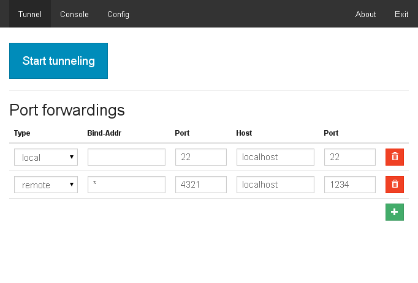
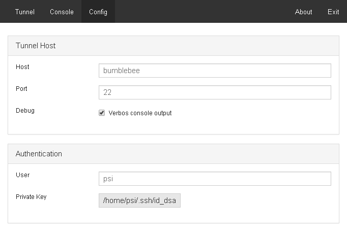

# QuickTunnel

Light platform independet GUI for establishing SSH tunnels using `ssh` cli or puttys `plink.exe` on windows.

Based on Node-WebKit and AngularJS

## Build
* Install build system: `npm install`
* Install deps: `bower install`
* Install node_modules for nodewebkit: `cd src && npm install`
* Build: `cd .. && node_modules/gulp/bin/gulp.js build`

## Usage
* Run the app from build/Quicktunnel/<your os>
* Setup your information in the _config_ tab
* Configure forwardings in the "Tunnel" tab and press "Start Runinng"

### Copyright
License: http://www.gnu.org/licenses/lgpl-3.0.html LGPL  
Author: [4ward.media](http://www.4wardmedia.de)
